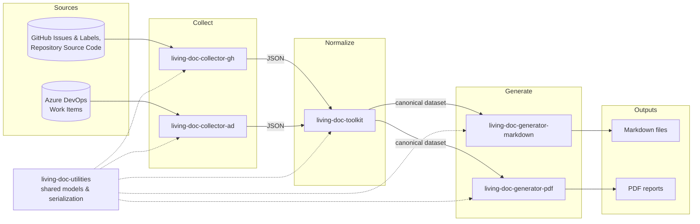
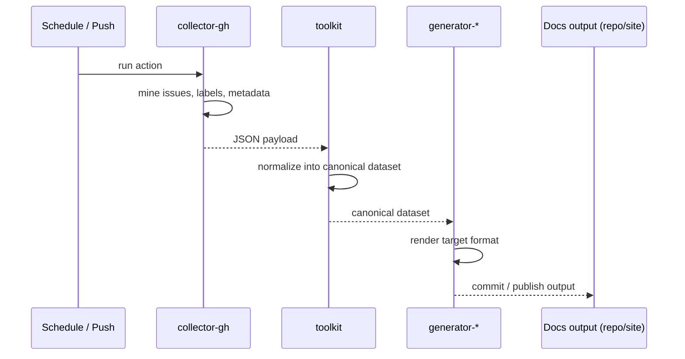

# Architecture

The ecosystem is split into three stages — **collect**, **normalize**, **generate** — connected by a shared JSON data shape defined in [living-doc-utilities](https://github.com/AbsaOSS/living-doc-utilities). Every project in the stack plugs into exactly one stage, which is what lets any collector feed any generator.

## Pipeline overview

## Stage responsibilities

| Stage | Project(s) | Responsibility |
|---|---|---|
| Collect | `collector-gh`, `collector-ad` | Talk to one source system's API, mine issues / work items / labels / source code, emit JSON. |
| Shared model | `utilities` | Define the data models and (de)serialization logic every other project imports, so collector output and generator input agree on shape. |
| Normalize | `toolkit` | Take one or more collector outputs and produce a single canonical dataset — resolving format differences between sources. |
| Generate | `generator-markdown`, `generator-pdf` | Take the canonical dataset and render one target format. |

## Typical run (GitHub Action)

Each stage runs as an independent GitHub Action, so a pipeline is assembled by chaining actions in a workflow file — see [Getting Started](../guides/getting-started.md).
