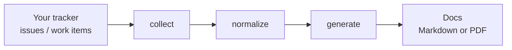

# Living Documentation in 5 Minutes

Living Documentation generates your project docs **from the tracker you already use** — GitHub
issues, Azure DevOps work items — so they never go stale. Brand new to the idea? Read
[What is Living Documentation?](what-is-living-documentation.md) first. Otherwise, follow along.

## The whole idea

Three stages, always in this order:



- **collect** — a *collector* pulls issues / work items out of your tracker as JSON.
- **normalize** — the *toolkit* turns that JSON into one canonical shape (needed even with a single source).
- **generate** — a *generator* renders the canonical data as Markdown or PDF.

Every stage is a separate GitHub Action. A pipeline is just those actions chained in one workflow
file. Full detail: [Architecture](architecture.md).

## Step 1 — Decide what you want to produce

This decides what you have to prepare for the collector to mine:

| You want a… | Prepare |
|---|---|
| **Technical project** — User Stories, Features, Functionalities | Issues labelled as US / Feature / Functionality, **or** the same entities as header blocks in source code |
| **Test catalog** — the behaviours your tests cover | Gherkin `.feature` files in the repo |
| **Coverage matrix** — which acceptance criteria have tests | Both of the above, for the same system |

Full detail: [Living Documentation Document Types](../guides/living-doc-document-types.md). The rest
of this guide builds a **technical project → Markdown** pipeline; swap the generator (or add a step)
for the others.

## Step 2 — Pick your two ends

| Your source | Collector |
|---|---|
| GitHub issues (and source-code header blocks) | [living-doc-collector-gh](https://github.com/AbsaOSS/living-doc-collector-gh) · [guide](../guides/github-collection.md) |
| Azure DevOps work items | [living-doc-collector-ad](https://github.com/AbsaOSS/living-doc-collector-ad) · [guide](../guides/azure-devops-collection.md) |

| You want | Generator |
|---|---|
| Markdown committed next to your code | [living-doc-generator-markdown](https://github.com/AbsaOSS/living-doc-generator-markdown) *(early stage)* |
| A shareable / archivable PDF report | [living-doc-generator-pdf](https://github.com/AbsaOSS/living-doc-generator-pdf) |

Undecided? → [Choosing a Generator](../guides/choosing-a-generator.md).

## Step 3 — Add one workflow file

The example below is **GitHub issues → Markdown**, refreshed nightly. Save it as
`.github/workflows/living-doc.yml`:

```yaml
name: Living Documentation

on:
  schedule:
    - cron: '0 4 * * *'      # nightly refresh
  workflow_dispatch:          # ...plus a manual "Run workflow" button

jobs:
  generate-docs:
    runs-on: ubuntu-latest
    permissions:
      contents: write
    steps:
      - uses: actions/checkout@v4

      # 1. COLLECT — mine issues into doc-issues.json
      - name: Collect from GitHub
        uses: AbsaOSS/living-doc-collector-gh@v1
        with:
          github-token: ${{ secrets.GITHUB_TOKEN }}
          repository: ${{ github.repository }}

      # 2. NORMALIZE — doc-issues.json -> canonical dataset (required, even for one source)
      - name: Set up Python
        uses: actions/setup-python@v5
        with:
          python-version: '3.10'
      - name: Normalize (toolkit)
        run: |
          pip install living-doc-toolkit
          living-doc normalize-issues --input doc-issues.json --output generator-ready.json

      # 3. GENERATE — canonical dataset -> Markdown files
      - name: Generate Markdown
        uses: AbsaOSS/living-doc-generator-markdown@v1
        with:
          source-path: generator-ready.json
          output-path: docs/generated

      # 4. COMMIT the refreshed docs
      - name: Publish
        run: |
          git config user.name "github-actions"
          git config user.email "github-actions@github.com"
          git add docs/generated
          git commit -m "docs: update living documentation" || echo "no changes"
          git push
```

> **Heads-up:** `generator-markdown` is early stage and its action inputs may still change; for a
> stable output today, generate a PDF instead ([User Stories → PDF](../tutorials/user-stories-to-pdf.md)).
> Each project's README is the authoritative source for its current inputs.

To use a different source or output, change **only the collect and generate steps** — the worked
examples below give you a copy-paste starting point for each combination.

## Step 4 — Run it

Commit the file, then in your repo: **Actions → Living Documentation → Run workflow**. (Or just wait
for the nightly run.)

## Step 5 — Check the result

Open `docs/generated/`. You should see Markdown that matches your issue tracker *right now* — one
file or section per issue category your labels define. Every run overwrites it with the current
state; that is the whole point.

## Go deeper

| To… | Read |
|---|---|
| Choose which document type(s) to produce, and what each needs | [Living Documentation Document Types](../guides/living-doc-document-types.md) |
| Build a pipeline properly, stage by stage | [Getting Started](../guides/getting-started.md) |
| Copy a working example for your exact source + output | [Getting Started § worked examples](../guides/getting-started.md#worked-examples) · [tutorials](../tutorials/) |
| Understand what each collector mines | [Collecting from GitHub](../guides/github-collection.md) · [Collecting from Azure DevOps](../guides/azure-devops-collection.md) |
| Write User Stories / Features / Functionalities in the format collectors read | [Living Doc Glossary](../guides/living-doc-glossary.md) · [Living Doc Header Types](../guides/living-doc-header-types.md) |
| Let an AI agent help author that content (optional) | [agentic-toolkit](../projects/agentic-toolkit.md) |
| See how the stages connect | [Architecture](architecture.md) |
| Browse every repo in the ecosystem | [Projects](../projects/) · [repo README](../../README.md#ecosystem) |
