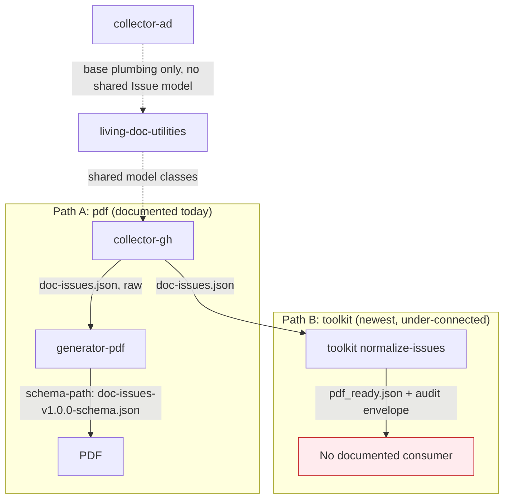
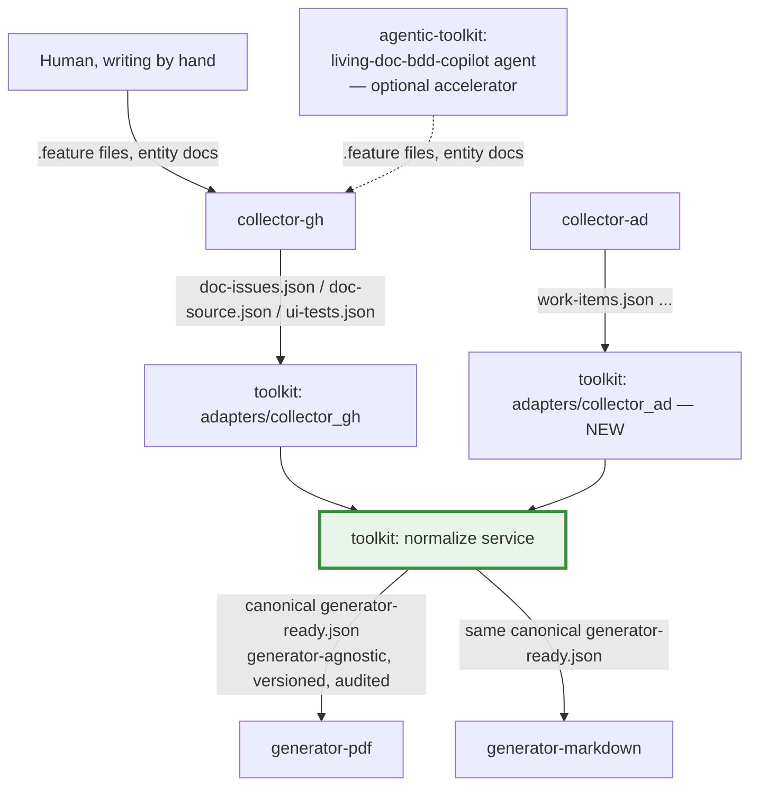

# Spec: Architecture — Unified GitHub Action & Support-Library Solution

**Status:** Draft — 2026-08-25
**Scope reviewed:** all 6 `living-doc-*` repos, cloned and read at source-code level (not README level).

## 1. Method and a correction to earlier assumptions

This spec is based on reading actual source (`action.yml`, entry points, `requirements.txt`/`pyproject.toml` dependency declarations, and — for `toolkit` — its own `docs/architecture.md` and `docs/contracts.md`), not on each repo's README alone. One thing this surfaced that's worth flagging up front: **`living-doc-toolkit` is materially further along than its README suggests at a glance.** It's a working monorepo with 6 versioned packages (`core`, `datasets_pdf`, `adapters/collector_gh`, `services/normalize_issues`, `services/coverage_matrix`, `apps/cli`), a documented adapter pattern, an audit-envelope provenance model, and golden-fixture tests across producer schema versions (`v0.9.0` through `v2.0.0`). Any architecture decision here should build on it, not around it.

## 2. Current architecture, as it actually exists in code

Two independent, non-converging paths exist simultaneously:

- **Path A — `generator-pdf`**: has **zero** dependency on either `living-doc-utilities` or `living-doc-toolkit` (`requirements.txt` has neither package). It's deliberately source-agnostic: `source-path` + `document-type` in, PDF out, with the source JSON passed to Jinja2 templates unchanged (`README.md`: "The action does not transform the source JSON"). Its documented example for `document-type: user-stories` validates against `generator/schemas/doc-issues-v1.0.0-schema.json` — i.e., **the collector's raw output schema**, not `toolkit`'s normalized output.
- **Path B — `toolkit`**: `normalize-issues` produces `pdf_ready.json`, explicitly named and scoped for the PDF generator (`docs/contracts.md`: "Target: living-doc-generator-pdf"). But `generator-pdf`'s `action.yml` carries `pdf_ready_json` only as a **deprecated alias** for the generic `source-path` input, and the README's own usage examples don't reference it. In practice, `toolkit`'s richest output (with audit provenance, section-heading normalization, version-compatibility warnings) has no documented, exercised consumer today.

`living-doc-collector-ad` sits differently again: it depends on `living-doc-utilities` only for plumbing (`constants`, `github.utils`, `logging_config`, `inputs.action_inputs`) — it does **not** use the shared `Issue`/`Issues`/`UserStoryIssue` model classes the way `collector-gh` does, because ADO work items aren't mapped into that model yet (only `work-items` mode exists; `boards`/`pipelines`/`test_plans`/`release_notes` are unimplemented — see [Documentation & Style Synchronization](doc-style-sync.md) §3.5).

## 2.1 Expected usage: GitHub Actions first, local CLI for debug only

Every piece in this ecosystem is packaged first as a GitHub Action (`action.yml` at the root of `collector-gh`, `collector-ad`, `generator-pdf`) or, for `toolkit`, as a CLI meant to be invoked as a workflow step. **The expected, supported usage pattern is chaining these actions inside a GitHub Actions workflow** — this is what every `README.md`'s "Adding the Action to Your Workflow" section documents, what every integration/example workflow in [CI Checks & QA Tooling](ci-qa-tooling.md) exercises, and what the tutorials in this repo (`docs/tutorials/`) walk through.

Running components locally — `collector-gh`/`collector-ad`'s documented `run_script.sh` pattern (`DEVELOPER.md`: hand-set `INPUT_*` env vars, `python3 main.py`), or `toolkit`'s `living-doc` CLI invoked directly (`living-doc normalize-issues --input ... --output ...`) — **is possible and already documented, but it is a development/debugging affordance, not a second first-class deployment target.** `toolkit`'s own `.github/copilot-instructions.md` already draws this distinction explicitly for its context section ("must assume components may run locally and/or on GitHub Actions runners"), which is more accurate for `toolkit` specifically (it's a CLI by nature) than for the three `action.yml`-based repos, where local execution exists purely so a contributor can iterate without pushing a branch and waiting on CI.

This matters for the target architecture in §5: the canonical `generator-ready` contract (see [Data Flows & Schemas](data-flows.md) §5 for final naming) needs to be easy to produce and validate from a workflow step (inputs/outputs as files on the runner's filesystem, action outputs pointing at them) — it does not need a polished standalone local UX, a config file format, or interactive prompts. Local usage only needs to stay good enough for a developer testing a change before opening a PR.

## 3. Why this matters: the user-stated goal

> toolkit should do normalisation for pdf, markdown — pdf and markdown generators should be able to consume same toolkit normalized output — pdf and markdown have both the same goal, different format only.

This is architecturally sound and it's *already partially built* — `toolkit`'s `normalize_issues` service already does the hard part (section-heading synonym mapping, ID normalization, audit-envelope construction) that a Markdown generator would need identically to a PDF generator. The gap is not "toolkit can't do this," it's:

1. `toolkit`'s output contract (`pdf_ready.json`) is **named and scoped for one consumer** rather than framed as the shared canonical dataset both generators should read.
2. `generator-pdf` was never actually wired to consume it in its current documented form (Path A bypasses Path B).
3. `generator-markdown` doesn't exist yet as code, so there's no second consumer to force the "same normalized input, two renderers" contract into existence.

## 4. The stage upstream of all of this: authoring — and a governing principle

Everything in §2–§3 starts from `collector-gh` mining GitHub Issues or `.feature` files that already exist. Those files don't write themselves, and someone or something authors User Story / Feature / Functionality entities and Gherkin scenarios before any collector ever runs. That authoring step *can* be accelerated by [`AbsaOSS/agentic-toolkit`](https://github.com/AbsaOSS/agentic-toolkit)'s `living-doc-bdd-copilot` agent — a Copilot/Claude-compatible AI agent + skill family, not a `living-doc-*` GitHub Action — but it does not have to be.

**Governing principle: the whole Living Documentation pipeline must run AI-free.** Every `living-doc-*` repo — `collector-gh`, `collector-ad`, `utilities`, `toolkit`, both generators — is, and must remain, deterministic tooling: Python scripts, JSON Schema validation, Jinja2/Markdown templates, no LLM call anywhere in the collect → normalize → generate path. A human can hand-write a `.feature` file or a GitHub Issue in the documented format with no AI involvement at all, and the rest of the pipeline behaves identically. `agentic-toolkit` does not change this: it is **acceleration for the authoring step, not a dependency of it.** An engineer typing out a User Story header block by hand, and the `living-doc-bdd-copilot` agent generating the same block from a conversational request, must produce output the collector mines identically — the agent's entire value is speed and consistency at authoring time, never a capability the pipeline requires to function. This extends to `agentic-toolkit`'s Playwright-based automation skills (`living-doc-pageobject-scan`, `data-cy-instrument`) too: browser scanning/crawling to generate PageObjects and scenarios is explicitly in scope as a legitimate accelerator, but a human writing the same PageObject or Gherkin scenario by hand is an equally valid, fully-supported path — the tool speeds up authoring, it doesn't gate it.

This shapes how "authoring" belongs in the architecture picture: it's the stage upstream of "collect," and it changes what "the ecosystem" means end to end — **author (human or AI-accelerated) → collect → normalize → generate** — but it is explicitly *optional acceleration* at that first stage only, never a runtime dependency anywhere downstream. See [Data Flows & Schemas](data-flows.md) §9 for the format comparison this stage's output needs to match, and [Copilot & AI-Agent Tooling](copilot-ai-tooling.md) for the same acceleration-only principle applied to how this ecosystem's own contributors use AI tooling.

## 4.1 The next task after v1: tutorial-capture scenario execution

Beyond the AC-linked scenarios `collector-gh`'s `ui-tests` mode is scoped to mine (§4, [Data Flows & Schemas](data-flows.md) §9), the same Gherkin/Playwright execution machinery can drive a different kind of scenario: **long-running, feature-based walkthroughs — structured like e2e tests, but tagged/flagged for a different purpose.** This ecosystem's scope here is narrow and concrete: **run the flagged scenarios and collect the outputs** — screenshots at each step plus step-level commentary — as structured artifacts. No video-generation skill is planned within this ecosystem or `agentic-toolkit`; turning the collected images-and-commentary into a narrated tutorial video is a downstream AI consumer of that output, entirely outside this pipeline's scope. What this ecosystem owns is the run-and-collect step, nothing past it.

This is **the first task queued up after v1 ships** — not a vague someday-maybe, the immediate next roadmap item once the v1 goal in [Roadmap](roadmap.md) is delivered. It depends on Phase 2's scenario-mining and execution machinery existing first, which is why it can't move earlier. See [Roadmap](roadmap.md)'s Post-v1 section.

## 5. Target architecture

Key changes from current state:

- **Rename the contract, not just the file**: `pdf_ready.json` → `generator-ready.json`, reflecting that its schema is the shared input for any renderer, with `pdf_ready` retained only as a deprecated alias during migration (mirroring how `generator-pdf` already deprecates `pdf_ready_json` as an input name — same pattern, applied one layer up).
- **`generator-pdf` gets a first-class `document-type` (or `schema-path`) entry for the canonical toolkit output**, not just the raw collector schema, so the documented golden path actually is `collector → toolkit → generator-pdf`.
- **`generator-markdown`, once built, consumes the identical canonical output** — same schema, same audit envelope, different template/render layer. This is the one-line justification the user gave, made structural: the two generators differ only in `templates/` + rendering library (Jinja2+WeasyPrint vs. Jinja2+Markdown), not in what they consume.
- **A `collector_ad` adapter package in `toolkit`**, mirroring `adapters/collector_gh`, once ADO work-items mode has a stable enough schema to adapt (this can follow, not block, the pdf/markdown convergence).

## 6. Tasks

**Phase 1 — establish the shared contract**
- [ ] In `toolkit`, generalize `pdf_ready` (`packages/datasets_pdf`, `docs/contracts.md`) into a format-agnostic canonical schema (final name: `generator-ready` v1 — see [Data Flows & Schemas](data-flows.md) §5 for the naming rationale) — same fields, reframed as "the normalized input any generator renders," not "PDF-specific."
- [ ] Update `toolkit/docs/contracts.md` §"Output Contract" to name both `generator-pdf` and (planned) `generator-markdown` as consumers, dropping the single-target framing.
- [ ] Add a deprecation alias so existing `pdf_ready.json` output filename/schema-version keeps working during migration (same shape as `generator-pdf`'s own `pdf_ready_json` → `source-path` alias pattern).

**Phase 2 — wire generator-pdf onto the shared contract as primary path**
- [ ] Add the canonical `generator-ready-v1.0.0` schema to `generator-pdf/generator/schemas/`, document it in `README.md` as the recommended `document-type: user-stories` source (today's doc points at the raw collector schema instead).
- [ ] Update `generator-pdf/README.md`'s Quick Start to show `collector-gh → toolkit normalize-issues → generator-pdf`, not `collector-gh → generator-pdf` directly.

**Phase 3 — build generator-markdown against the shared contract from day one**
- [ ] Scaffold `living-doc-generator-markdown` to consume the same `generator-ready-v1.0.0` schema `generator-pdf` now documents — do not let it invent its own input contract the way `generator-pdf` originally did before toolkit existed.
- [ ] Share template-organization conventions (`templates/{document-type}/...`) between `generator-pdf` and `generator-markdown` where the two aren't format-specific, to keep the "same data, different format" symmetry visible in the codebase, not just the docs.

**Phase 4 — collector-ad integration**
- [ ] Build a `toolkit/packages/adapters/collector_ad` package once `collector-ad`'s work-items schema is stable, so ADO-sourced docs join the same canonical pipeline as GitHub-sourced ones.

**Phase 0 — state the usage model explicitly (small, do first)**
- [ ] Add a one-paragraph "Expected usage" note (GitHub Actions workflow is the supported path; local CLI/script execution is for development and debugging only) to each repo's `README.md`, near the top — today only `toolkit`'s internal `copilot-instructions.md` draws this distinction, and only implicitly.
