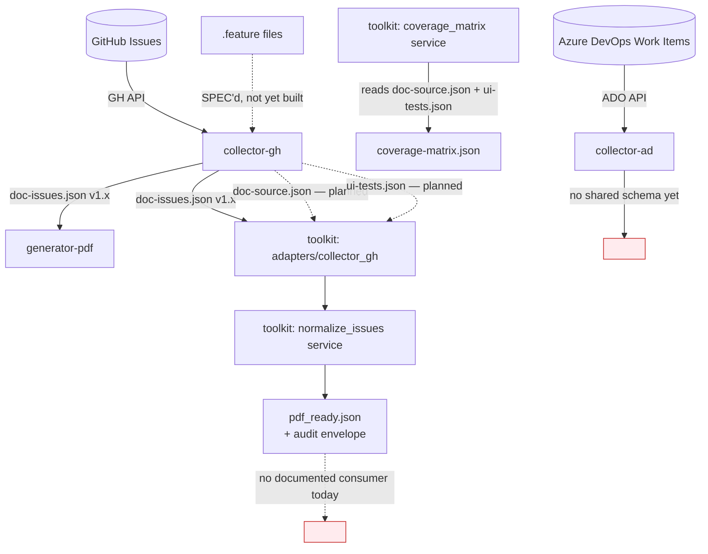

# Spec: Data Flows, Formats & Schemas

**Status:** Draft — 2026-08-25
**Scope reviewed:** all 6 `living-doc-*` repos, at schema-file and source-code level.

## 1. Method

Every `*-schema.json` file across the 6 repos was located and diffed byte-for-byte against same-named copies in other repos. Version-compatibility logic (`toolkit/packages/adapters/collector_gh/compatibility.py`, `SCHEMA_SYNC.md`) was read directly, not summarized from README claims.

## 2. Current data flow, end to end

Three facts drive everything else in this document:

1. `doc-issues.json` (collector-gh's output) is consumed by **two independent parsers** — `generator-pdf` (as raw, untransformed JSON passed to Jinja2 templates) and `toolkit`'s adapter (via its own Pydantic models). Neither shares parsing code with the other.
2. `toolkit`'s `coverage-matrix` service is a real, tested, working cross-reference between `doc-source.json` (User Stories + ACs) and `ui-tests.json` (BDD scenarios) — but both of those *inputs* are specced in `collector-gh/SPEC.md` and not yet implemented in `collector-gh`'s shipped code (`doc_source/` and `ui_tests/` packages don't exist in the current tree; only `doc_issues/` does). `coverage_matrix`'s golden-fixture tests currently exercise it against hand-built fixtures, not live collector output.
3. `collector-ad` produces no schema-versioned, `toolkit`-adapted output at all yet — it's a standalone JSON producer with no downstream contract.

## 3. Schema duplication and drift

The same logical schema exists as **separately-maintained files in multiple repos**, with no automated check that they stay in sync:

| Schema | Copy 1 | Copy 2 | Copy 3 |
|---|---|---|---|
| `doc-issues-v1.0.0-schema.json` | `living-doc-collector-gh/doc_issues/schema/` (hand-authored, compact JSON) | `living-doc-toolkit/packages/adapters/collector_gh/schemas/` (Pydantic-exported, verbose) | `living-doc-generator-pdf/generator/schemas/` |
| `doc-source-v1.0.0-schema.json` | `living-doc-collector-gh/doc_source/schema/` | `living-doc-toolkit/packages/services/coverage_matrix/src/.../schema/` | — |
| `coverage-matrix-v1.0.0-schema.json` | `living-doc-toolkit/packages/services/coverage_matrix/src/.../schema/` | `living-doc-generator-pdf/generator/schemas/` | — |
| `ui-tests-v1.0.0-schema.json` | `living-doc-collector-gh/ui_tests/schema/` (per SPEC.md; not yet present in shipped tree) | `living-doc-generator-pdf/generator/schemas/` | — |

Diffing `collector-gh`'s and `toolkit`'s copies of `doc-issues-v1.0.0-schema.json` byte-for-byte: they are **structurally equivalent** (same `$defs`, same required fields, same shape) but formatted completely differently — one hand-written compact, one machine-generated from Pydantic with per-field `"title"` annotations. This is consistent with `toolkit`'s own documented design (`SCHEMA_SYNC.md`): a deliberate **"Pydantic-First" pattern where the two repos have no code dependency and sync the schema as a published artifact, by hand**. That's a legitimate decoupling choice — but it currently has **no verification step**. If `toolkit`'s Pydantic model changes and the corresponding update to `collector-gh`'s hand-maintained copy is missed, nothing in CI catches it (see [CI Checks & QA Tooling](ci-qa-tooling.md)). `collector-gh`'s own docs don't reference `SCHEMA_SYNC.md` or acknowledge this obligation from its side at all — the sync contract is documented in only one of the two repos that must honor it.

`SCHEMA_SYNC.md` also has an internal inconsistency worth a two-line fix: the "Producer Compatibility Range" is stated as `>=1.0.0,<2.0.0` early in the document (matching `compatibility.py`'s actual `CONFIRMED_MIN = "1.0.0"` / `CONFIRMED_MAX = "2.0.0"`), but the later "Key Constants" reference block shows `CONFIRMED_MIN = "0.1.0"` — a stale value that doesn't match the code.

### 3.1 An ownership rule, and which duplicates actually violate it

A clean rule to adopt going forward: **the repo that first produces a given output owns its schema; any other repo that consumes that output may keep a local copy purely for load-time validation, sourced from the owner.** Applying that rule to the four duplicates found above changes the verdict on three of them:

| Schema | Owner (per the rule) | Copies elsewhere | Verdict under the rule |
|---|---|---|---|
| `doc-issues-v1.0.0-schema.json` | `collector-gh` (it produces `doc-issues.json`) | `toolkit` (consumer, adapter validation), `generator-pdf` (consumer, opt-in `schema-path` validation) | **Legitimate** — both copies are exactly the "consumer copy for load validation" the rule allows. The problem isn't that copies exist; it's that nothing verifies the copies still match the owner's version (§3 above, §10 tasks below). |
| `coverage-matrix-v1.0.0-schema.json` | `toolkit` (its `coverage_matrix` service produces `coverage-matrix.json`) | `generator-pdf` (consumer, opt-in validation) | **Legitimate**, same reasoning. |
| `ui-tests-v1.0.0-schema.json` | `collector-gh`, per its own `SPEC.md` (once the `ui-tests` mode ships) | `generator-pdf` (consumer copy, already present) | **Legitimate in intent**, but currently ownerless in practice — the "owner" hasn't shipped the schema yet (see below). |
| `doc-source-v1.0.0-schema.json` | `collector-gh`, per its own `SPEC.md` (once the `doc-source` mode ships) | `toolkit` (`packages/services/coverage_matrix/.../schema/`) | **Violates the rule as it stands today.** `collector-gh` hasn't shipped this schema in its actual tree — only `doc_issues/` exists there, not `doc_source/`. `toolkit` is not a "consumer holding a validation copy of an owner's schema"; it's the *only* place this schema currently exists, i.e. it has become the de facto owner of a schema for an output it doesn't produce. |

So: most of what §3 calls "duplication" is fine under this rule — it's the *unsynced-copy* problem, not an ownership problem. The one real ownership gap is `doc-source-v1.0.0-schema.json` (and, less acutely, `ui-tests-v1.0.0-schema.json`): `toolkit` is currently authoring the input contract for data a different repo is supposed to produce, before that repo has produced it. This should resolve itself once `collector-gh` ships the `doc-source`/`ui-tests` modes from its `SPEC.md` — at that point ownership should formally transfer to `collector-gh`, and `toolkit`'s copies should become explicitly-labeled validation copies sourced from there, the same way its `doc-issues` copy already is (per `SCHEMA_SYNC.md`).

### 3.2 The sync mechanism: pin to a tag, vendor the file, let a bot keep it honest

The instinct behind the ownership rule (§3.1) is right, and the natural next question is: once a schema change is merged into the owning repo's default branch, shouldn't consumers just link to it there instead of hand-copying content? Yes — but "link to `master`" needs one refinement before it's safe to build.

**Why not link straight to `master`:** the owner's `master` is a moving target. If a consumer's validation step fetches the schema from `master` at run time, two things go wrong: (1) the owner can silently change the schema in a way that breaks every consumer's next CI run, with no version boundary either side agreed to cross, and (2) every validation run now has a hard network dependency on GitHub being reachable, which `toolkit`'s own stated design principle explicitly avoids elsewhere (`docs/architecture.md`'s Security Considerations: *"No network requests during processing"*). Both problems trace back to the same cause: `master` isn't a version, it's a moving pointer.

**The fix: pin to a released version, not a branch — and keep a bot-synced vendored copy, not a hand-copied one.**

1. The owner (e.g. `collector-gh`) publishes the schema as a versioned release asset — `SCHEMA_SYNC.md` already half-describes this ("Create release with schema as artifact"), it just isn't wired to anything yet.
2. Each consumer's committed schema copy is **fetched by a script or scheduled workflow from a specific pinned tag** (e.g. `raw.githubusercontent.com/AbsaOSS/living-doc-collector-gh/v1.0.0/doc_issues/schema/doc-issues-v1.0.0-schema.json`), not typed by hand and not read from `master` at request time. The pinned tag matches the consumer's own confirmed-compatible range (`compatibility.py`'s `CONFIRMED_MIN`/`CONFIRMED_MAX`) — bumping the pin is a deliberate, reviewed action (a PR, same as a dependency bump), not something that happens automatically when the owner ships a new version.
3. A CI check in the consumer repo re-fetches the schema from that exact pinned tag and diffs it against the committed copy — if they differ, someone edited the vendored file by hand instead of going through the sync script, and the build fails. This is what actually closes the drift gap from §3: not "always fetch live," but "the committed copy can never silently diverge from what its own pin says it should be."

This gets both properties at once: CI validation stays offline-safe and fast (no network call on every run — the vendored file is read locally), and the copy can never go stale without a human deliberately deciding to move the pin forward. It's the same shape as `toolkit`'s own compatibility-range design (§4) applied one layer earlier in the pipeline — a confirmed, explicit version boundary instead of an implicit "whatever's current."

## 4. Version compatibility — what's actually implemented well

This deserves credit, not just critique: `toolkit`'s adapter has real, tested multi-version handling. Golden fixtures exist for collector-gh output at `v0.9.0`, `v1.0.0`, `v1.2.0`, and `v2.0.0` (`living-doc-toolkit/tests/fixtures/collector_gh/`), and `compatibility.py` implements a clean semver range check (`>=1.0.0,<2.0.0`) that **warns and still attempts processing** on an out-of-range version rather than hard-failing — the warning is captured in the output's `audit.trace[].warnings[]`, preserving provenance. This is a good pattern and the rest of the ecosystem doesn't yet have an equivalent — `generator-pdf` has no version-compatibility check on its inputs at all; it either parses successfully or throws an unstructured error.

## 5. The `pdf_ready.json` naming problem, restated as a data-flow issue

Per [Architecture](architecture.md), `toolkit`'s `normalize-issues` output is explicitly named and schema'd around one consumer. Concretely, `docs/contracts.md`'s own "Output Contract" section header is `pdf_ready.json`, the schema-version field literally reads `"schema_version": "1.0"` with no PDF-vs-markdown discriminator, and the section-heading synonym table (`description`/`business_value`/`preconditions`/`acceptance_criteria`/`user_guide`/`connections`/`last_edited`) is generic prose-to-structured-data mapping that a Markdown renderer would need verbatim. There is nothing in the current schema that is actually PDF-specific — the coupling is in the *name* and the *stated target* in the docs, not in the data shape.

**Verdict: yes, rename it.** Every field in the documented structure (`meta.document_title`, `meta.source_set`, `meta.selection_summary`, `content.user_stories[].sections{...}`) reads as document-content-agnostic-of-output-format. Nothing in it references PDF, PDF page layout, or WeasyPrint. This makes the rename low-risk: it's a documentation and naming change on an already-generic schema, not a redesign.

### Naming proposal

| Candidate | Reads as | Verdict |
|---|---|---|
| `generator-ready.json` | "ready to be consumed by any generator" | **Recommended** (revised — see below). Says explicitly what the file is *for*, not just that it's "ready." |
| `doc_ready.json` | "ready to be rendered as documentation, by any renderer" | Original recommendation; superseded. Smallest edit distance from `pdf_ready.json`, but has a real ambiguity: this repo's own pipeline produces actual rendered *documents* (PDF, Markdown) one stage later — a reader could easily mistake "doc ready" for "the finished document is ready," when what it actually means is "structured data, ready to be handed to a generator." `generator-ready` doesn't have that collision. |
| `doc_dataset.json` | "the canonical dataset" | Reuses `toolkit`'s own existing vocabulary ("canonical datasets for downstream generators") exactly. Still a reasonable second choice, but less immediately clear than `generator-ready` about *why* it's ready — ready for what? |
| `normalized_issues.json` | "the output of the normalize-issues command" | Rejected — names the *process* that produced the file, not what the file *is for*. Also inaccurate per §7 below: what this command does is broader than normalization alone. |
| `render_ready.json` | "ready for any renderer" | Rejected — close to `generator-ready` in meaning, but "render" isn't otherwise used as a term anywhere in `toolkit`'s docs today, while "generator" is the term the whole ecosystem already organizes itself around (`generator-pdf`, `generator-markdown`). |

**Final recommendation: `generator-ready.json`.** Two things changed the verdict from the original `doc_ready.json` pick:

1. **It resolves the "which stage is this?" ambiguity `doc_ready` still had.** The pipeline's actual end products *are* documents (a PDF, a Markdown file) — naming the pre-render dataset "doc-ready" sits one step too close to that language. "Generator-ready" is unambiguous: it's input *to* a generator, not output *from* one.
2. **It matches the ecosystem's existing majority artifact-naming convention.** Every other top-level JSON artifact in the pipeline is kebab-case — `doc-issues.json`, `doc-source.json`, `ui-tests.json`, `coverage-matrix.json` — produced by `collector-gh`. `pdf_ready.json` (snake_case) is already the odd one out, a byproduct of `toolkit`'s own Python-package naming (`datasets_pdf`, `pdf_ready`) leaking into the artifact filename. Renaming to `generator-ready.json` fixes the "PDF-specific" problem *and* the naming-convention drift in one move, rather than trading one snake_case PDF-flavored name for another snake_case name.

Schema file: `generator-ready-v1.0.0-schema.json`, matching the kebab-case + `v<major>.<minor>.<patch>` convention `doc-issues-v1.0.0-schema.json` and its siblings already use (rather than `toolkit`'s internal `_v1.schema.json` convention, which stays fine for files that never leave the Python package, like `audit_envelope_v1.schema.json`).

Migration, mirroring the pattern `generator-pdf`'s own `action.yml` already uses for its `pdf_ready_json` input (deprecated alias, not a hard break):

1. `toolkit` emits `generator-ready.json` as the primary output; `--output pdf_ready.json` continues to work as a deprecated, undocumented-but-functional alias for one or two minor versions.
2. `packages/datasets_pdf` keeps its Python package name for now — a package rename is a bigger, riskier move than the artifact rename and shouldn't block it; track it as an optional follow-up once `generator-markdown` actually exists and needs the package too.
3. `docs/contracts.md`'s "Output Contract" section retitles to `generator-ready.json`, and its "Target" line changes from "living-doc-generator-pdf" to "any generator consuming the canonical dataset (living-doc-generator-pdf, living-doc-generator-markdown)".

## 6. Coverage-matrix data flow — the one clean multi-hop pipeline that exists today

`doc-source.json` + `ui-tests.json` → `toolkit coverage-matrix` → `coverage-matrix.json` → (optionally) `generator-pdf --document-type coverage-matrix`. This is the only path in the whole ecosystem that currently goes collector-shape → toolkit-normalize → generator-render end to end as designed. It's worth using as the template for what the `doc-issues.json` → `generator-ready.json` → {`generator-pdf`, `generator-markdown`} path should look like once built out per [Architecture](architecture.md) Phase 1–3 — except that today, its own first hop (`doc-source.json`/`ui-tests.json` production) doesn't exist yet in `collector-gh`'s shipped code, only in `SPEC.md`.

## 7. Terminology: is `normalize-issues` actually normalization?

Worth pinning down precisely, because the answer changes what a contributor should expect when they open that service's code.

- **Normalization**, precisely, means: taking data that already carries the intended meaning but arrives in more than one valid surface form, and mapping it to *one* consistent representation — without adding, removing, or deriving new information. Database normalization (eliminating redundant storage of the same fact), Unicode normalization (NFC/NFD), and case-folding are the classic examples. Applied here: mapping the heading synonyms `Description`/`Overview`/`Summary` all to the single canonical key `description` (per `docs/contracts.md`'s synonym table) **is** normalization, textbook-precisely. Same content, one shape, nothing added or inferred.
- **Transformation** is the broader term: any process that maps input to different output. It subsumes normalization but also covers things normalization doesn't: **enrichment** (deriving and adding new data not present in the source — computing `meta.selection_summary.included_items`, constructing the `audit` envelope with `trace[]` and warnings), **restructuring** (changing the overall shape — `doc-issues.json`'s `AdapterResult`/`user_stories[]`/`metadata`/`warnings` becomes `generator-ready.json`'s `meta`/`content.user_stories[].sections{...}`, a materially different top-level layout), and **adaptation** (detecting producer format and parsing raw JSON into a typed internal representation before any of the above happens — `toolkit`'s adapter-pattern step in [Architecture](architecture.md) terms).

So, concretely: what `toolkit normalize-issues` does end to end is **adapt → normalize → enrich → restructure** — normalization (the heading-synonym mapping) is one real stage inside a larger transformation pipeline, not the whole of what the command does. Calling the whole thing "normalization" is a common, defensible looseness in data-engineering usage (ETL "normalize" steps routinely include cleanup + reshaping in practice, not just canonicalization), so this isn't grounds to rename the CLI command or the service package — `normalize-issues` still correctly names the *dominant, user-facing intent* ("make this consistent and usable downstream"). What's worth doing is making the four sub-stages legible in the code/docs themselves — right now `normalizer.py` and `builder.py` (per `toolkit/docs/architecture.md`'s component breakdown) roughly correspond to "normalize" and "enrich + restructure" respectively, but nothing documents that split in those terms, so a contributor fixing a "normalization bug" might not realize the bug they're chasing is actually in the restructuring stage.

## 9. The authoring-side source of truth

Everything documented elsewhere in this spec and in [Architecture](architecture.md) starts at `collector-gh` mining GitHub Issues or `.feature` files that already exist. Those files don't write themselves: `agentic-toolkit`'s `living-doc-bdd-copilot` agent is what an engineer runs to *author* the User Story / Feature / Functionality entities and their Gherkin scenarios in the first place — or a human can write them by hand — using the entity IDs, AC/tag grammar, and header formats defined in this repo's [Living Doc Glossary](../guides/living-doc-glossary.md) and [Living Doc Header Types](../guides/living-doc-header-types.md). Those two pages are the canonical format; `agentic-toolkit`'s `shared` skill is synced from them.

`collector-gh`'s planned `doc-source` and `ui-tests` modes should be implemented against that same format, including fields not yet reflected in `doc-issues-v1.0.0-schema.json` today (`not_in_scope`, AC-level precondition/not_in_scope extensions, deprecation and descoped-AC metadata, the `@AC:<id>/aspect:<value>` tag syntax, and Functionality-level header mining). This is a schema *version* question for `generator-ready.json` (§5) and the `doc-issues`/`doc-source` schemas, not a redesign — additive `v1.x` if every new field can be optional, otherwise `v2.0.0`. Tracked as a Phase 2 task — see [Roadmap](roadmap.md).

## 10. Tasks

- [ ] Implement the pin-and-vendor sync mechanism from §3.2: `collector-gh` publishes `doc-issues-v1.0.0-schema.json` as a release asset on tagged releases; `toolkit` and `generator-pdf` each get a small sync script/scheduled workflow that fetches from their pinned tag (matching their own confirmed-compatible range) into their vendored copy, plus a CI check that fails if the vendored copy no longer matches a fresh fetch of that exact pin. This replaces the vaguer "add a CI check" placeholder from an earlier pass of this spec — the mechanism is now: pin to a release tag, vendor locally, verify on every build; never fetch `master` live.
- [ ] Fix `SCHEMA_SYNC.md`'s "Key Constants" block: `CONFIRMED_MIN` should read `"1.0.0"`, matching `compatibility.py` and the earlier text in the same document.
- [ ] Add a `SCHEMA_SYNC` obligation note to `collector-gh`'s own `DEVELOPER.md` or `doc_issues/README.md`, cross-referencing `toolkit/packages/adapters/collector_gh/SCHEMA_SYNC.md`, so the sync contract is visible from both sides.
- [ ] Once `doc-source`/`ui-tests` collector modes ship (per `collector-gh/SPEC.md`), re-run `toolkit coverage-matrix`'s golden tests against real collector output, not just hand-built fixtures, to confirm the schema-as-specced actually matches the schema-as-shipped.
- [ ] Rename `pdf_ready.json` → `generator-ready.json` (schema `generator-ready-v1.0.0-schema.json`) per §5's naming decision — tracked jointly with [Architecture](architecture.md) Phase 1, since this is one change viewed from two angles (architecture: who consumes it; data-flow: what it's called and schema'd as). Ship the old name as a deprecated alias, not a hard break.
- [ ] Once `collector-gh` ships its `doc-source`/`ui-tests` modes, formally transfer schema ownership for `doc-source-v1.0.0` and `ui-tests-v1.0.0` from `toolkit` to `collector-gh` (§3.1), and re-label `toolkit`'s copies as owner-sourced validation copies the same way `SCHEMA_SYNC.md` already documents for `doc-issues`.
- [ ] Add the adapt → normalize → enrich → restructure stage breakdown (§7) to `toolkit/docs/architecture.md`'s "Normalize-Issues Service Components" section, naming which of `normalizer.py` / `builder.py` owns which stage.
- [ ] Extend `toolkit/packages/adapters/collector_gh`'s version-compatibility pattern (confirmed range + warn-and-continue + audit trace) to `generator-pdf` and, once built, `generator-markdown` — currently only the toolkit adapter layer has this; the generators have no equivalent input-version awareness.
- [ ] Design and document a `doc-issues.json` equivalent contract for `collector-ad` (`work-items.json`?) so a `toolkit/packages/adapters/collector_ad` (per [Architecture](architecture.md) Phase 4) has a stable target to adapt against.
